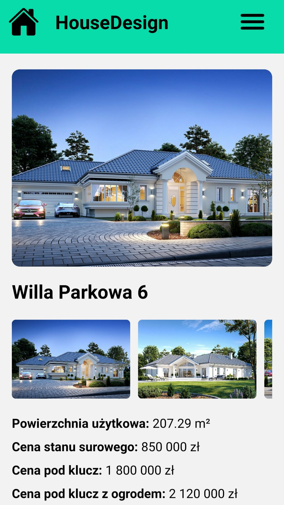

# House Design

## Screenshots

    </img>
     
    </img>
     
    </img>
     
    </img>

## Description

-   The app offers a wide range of house designs tailored to different needs and budgets.
-   The built-in Construction Calculator allows users to quickly estimate building costs based on a few simple questions.
-   A modern and intuitive app built with React Native, ensuring smooth performance on both iOS and Android.
-   A dynamic and responsive UI adapts to various screen resolutions, ensuring a comfortable user experience.
-   Context API is utilized for efficient state management, improving the app’s performance and scalability.
-   Integrated push notification system to keep users informed about new projects and updates on construction pricing.

#### Technology used:

-   React Native
-   JavaScript
-   Typescript
-   React Hooks
-   React Native StyleSheet
-   Axios
-   Created Context for efficient state management

## Author info

-   **Name:** Filip Bereszyński
-   **Contact:**
    -   bereszynski.filip@gmail.com
    -   (+48) 510 240 074
